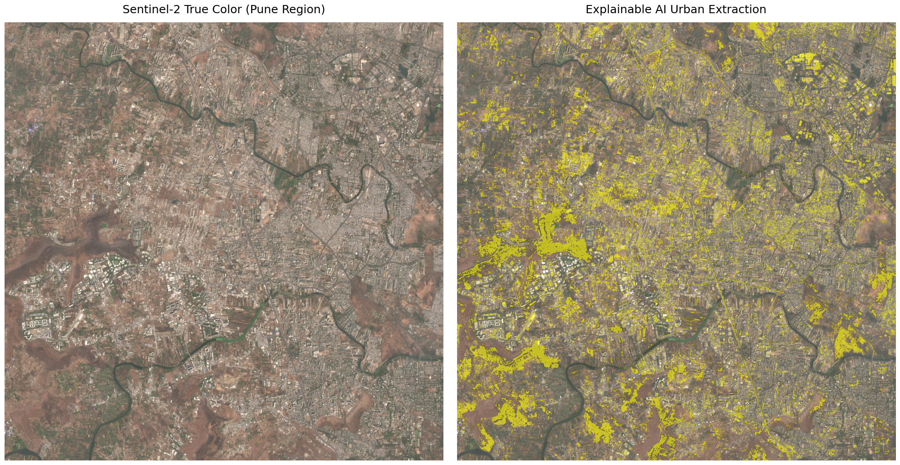
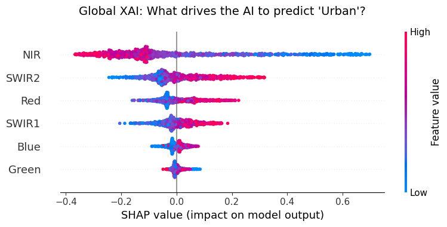

# 🌍 GeoAI-UrbanX: Data-Centric XAI for Urban Sprawl

**Mapping urban expansion using cloud-native Sentinel-2 data, Microsoft Planetary Computer, and Explainable AI (SHAP).**

 
*(Left: Sentinel-2 True Color of Pune, India. Right: Random Forest Urban Sprawl Extraction)*

## 🚨 The Interpretability Crisis in GeoAI
Semantic segmentation models for Earth Observation (EO) often achieve 95%+ accuracy but operate as complete "Black Boxes." In high-stakes domains like urban planning, relying on an uninterpretable model is dangerous we must know *why* a model classifies an area as "Urban." 

**GeoAI-UrbanX** adopts a **Data-Centric XAI** approach. It doesn't just predict urban footprints; it mathematically audits the algorithm to prove it relies on remote sensing physics rather than spurious environmental correlations.

## 🧠 The Architecture
1. **Cloud-Native Pipeline:** Zero-download extraction of Sentinel-2 multi-spectral imagery via the **Microsoft Planetary Computer STAC API**. Handles on-the-fly bilinear resampling to align 20m SWIR bands with 10m Optical bands.
2. **The Black Box:** A `scikit-learn` Random Forest Classifier trained on over 100,000 pixels.
3. **The XAI Auditor:** `shap.TreeExplainer` unpacks the Black Box, proving the model correctly isolates Shortwave Infrared (SWIR) reflectance to identify concrete, while penalizing Near-Infrared (NIR) vegetation signatures.

## 🔬 The Data-Centric Fix: Beating Spectral Confusion
During initial auditing, the model suffered from **Spectral Confusion** it misclassified fallow dirt and muddy riverbanks as "Urban" because dry soil also reflects high amounts of SWIR light. 

Instead of tweaking model hyperparameters, this pipeline implements a strict, data-centric physical constraint:
* **NDWI (Normalized Difference Water Index)** was utilized to mathematically ban water signatures.
* **NDBI (Normalized Difference Built-up Index)** thresholds were tightened to filter out barren land.
* **Result:** A pristine, physics-backed extraction mask that perfectly maps the concrete grid while ignoring rivers and dry farms.

## 📊 Explainable AI in Action (Local Explanation)

*By auditing a single urban pixel, SHAP proves the model learned that high SWIR reflectance (concrete/asphalt) drives the 'Urban' prediction.*

## 🚀 How to Run Locally

This project is built entirely in Python and requires no manual satellite data downloads.

1. Clone the repository:
```bash
git clone https://github.com/sanatladkat/GeoAI-UrbanX.git
cd GeoAI-UrbanX 
```

2. Install the dependencies:
```bash
pip install -r requirements.txt
```

3. Launch the Jupyter Notebook:
```bash
jupyter notebook notebooks/GeoAI_UrbanX_Pune.ipynb
```